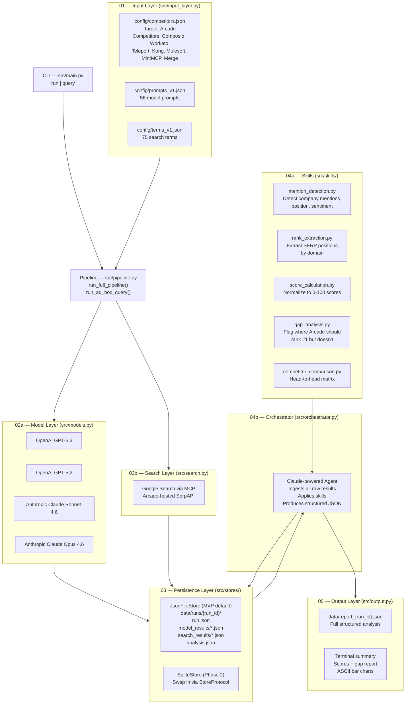

# AIO Analyzer

**AI & Search Visibility Benchmarking Tool** — measures how [Arcade](https://arcade.dev) ranks against competitors across both AI-generated answers (AIO) and traditional search results (SEO).

> Owners: Tyler, Jonnel — MVP status, March 2026

---

## What It Does

> **Current runtime mode: SEO-only.** The AIO model layer exists as scaffolding but is not active in this version. Only search-engine visibility is measured and scored.

1. Takes a set of **search terms** as input (model prompts are defined but not used in this version)
2. Fans them out to **Google Search via MCP** (Arcade-hosted SerpAPI) to measure SEO positioning
3. Persists all raw results as **JSON files on disk** (swappable to SQLite or Postgres via `StoreProtocol`)
4. An **Anthropic Claude-powered orchestrator agent** analyzes the stored results and produces structured scores, observations, and gap analysis

---

## Application Topology



---

## Project Structure

```
AIOAnalyzer/
├── .env.example                   # API key template — copy to .env
├── pyproject.toml                 # Dependencies, managed by uv
├── config/
│   ├── competitors.json           # Target (Arcade) + 7 competitors
│   ├── prompts_v1.json            # 56 model prompts (AIO benchmarking)
│   └── terms_v1.json              # 75 search terms (SEO benchmarking)
├── src/
│   ├── main.py                    # CLI entrypoint (run / query commands)
│   ├── pipeline.py                # Core logic — called by CLI and future API
│   ├── input_layer.py             # Pydantic models + config loaders
│   ├── models.py                  # LLM API integrations (OpenAI, Anthropic)
│   ├── search.py                  # Search integration (Google via MCP/SerpAPI)
│   ├── orchestrator.py            # Claude-powered analysis agent
│   ├── output.py                  # JSON report + terminal summary
│   ├── store.py                   # StoreProtocol interface definition
│   └── stores/
│       ├── json_store.py          # JsonFileStore — MVP default
│       └── sqlite_store.py        # SqliteStore — Phase 2
│   └── skills/
│       ├── mention_detection.py   # Detect + classify company mentions in LLM output
│       ├── rank_extraction.py     # Extract SERP positions by domain
│       ├── score_calculation.py   # Normalize to 0-100 AIO/SEO scores
│       ├── gap_analysis.py        # Identify gaps where Arcade should rank #1
│       └── competitor_comparison.py  # Head-to-head matrix across all companies
├── data/
│   └── runs/                      # Created at runtime — one dir per run
└── tests/
    ├── test_input_layer.py
    ├── test_models.py
    ├── test_orchestrator.py
    ├── test_output.py
    ├── test_pipeline.py
    ├── test_search.py
    ├── test_skills.py
    └── test_store.py
```

---

## Setup

### 1. Install uv (if not already installed)

```bash
curl -LsSf https://astral.sh/uv/install.sh | sh
```

### 2. Install dependencies

```bash
uv sync
```

This will automatically fetch Python 3.11+ and install all dependencies into `.venv`.

### 3. Configure API keys

```bash
cp .env.example .env
```

Edit `.env` and fill in the API keys:

| Variable | Where to get it |
|---|---|
| `ANTHROPIC_API_KEY` | console.anthropic.com |
| `ARCADE_API_KEY` | arcade.dev dashboard |
| `ARCADE_USER_ID` | arcade.dev dashboard |
| `OPENAI_API_KEY` *(not used in SEO-only mode)* | platform.openai.com |
| `MCP_SERVER_URL` *(optional)* | Defaults to `https://api.arcade.dev/mcp/AIO` |

---

## Usage

### Run the full benchmark pipeline

Runs all 75 search terms via MCP-powered Google Search in SEO-only mode, then produces a competitive analysis report. The AIO model fan-out is scaffolded but not active.

```bash
uv run python -m src.main run
```

With custom config paths:
```bash
uv run python -m src.main run \
  --prompts config/prompts_v1.json \
  --terms config/terms_v1.json \
  --competitors config/competitors.json \
  --output-dir data
```

### Run an ad-hoc query

Runs a single query as a search term (SEO-only) for a fast competitive snapshot. The query is passed to the search/orchestrator path, not live AIO model fan-out.

```bash
uv run python -m src.main query "What is the best MCP gateway for enterprises?"
```

---

## Ideal Workflow

```
1. Populate .env with API keys
2. (Optional) Edit config/prompts_v1.json and config/terms_v1.json
   to add or modify prompts/terms
3. Run: uv run python -m src.main run
4. Output lands in:
     data/runs/{run_id}/          ← raw results, one JSON file per result
     data/report_{run_id}.json    ← full structured analysis
     terminal                     ← human-readable summary with scores
5. Review the gap_report section of the JSON for highest-priority items
6. Repeat over time to track whether Arcade's visibility is improving
```

---

## Output Schema

The final report JSON (`data/report_{run_id}.json`) conforms to this structure:

```json
{
  "run_id": "...",
  "generated_at": "2026-03-17T12:00:00Z",
  "summary": {
    "arcade_avg_aio_score": 72,
    "arcade_avg_seo_score": 45,
    "top_competitor": "Composio",
    "biggest_gap": "prompt p003 — MCP Runtime"
  },
  "aio_results": [
    {
      "prompt_id": "p001",
      "prompt_text": "...",
      "category": "mcp-gateway",
      "expected_winner": "Arcade",
      "by_model": {
        "openai": {
          "mentions": { "Arcade": { "mentioned": true, "position": "first", "sentiment": "positive", "context_snippet": "..." } },
          "scores": { "Arcade": 85 }
        }
      },
      "aggregate_score": { "Arcade": 78, "Composio": 42 },
      "observations": "..."
    }
  ],
  "seo_results": [ "..." ],
  "gap_report": [
    {
      "id": "p003",
      "type": "aio",
      "text": "...",
      "expected": "Arcade",
      "actual_winner": "Composio",
      "arcade_score": 30,
      "winner_score": 88,
      "recommendation": "..."
    }
  ]
}
```

---

## Storage Architecture

The persistence layer is designed to be swappable. All storage goes through `StoreProtocol` (`src/store.py`):

| Backend | Class | Status | When to use |
|---|---|---|---|
| JSON files | `JsonFileStore` | **MVP default** | Local development, easy inspection |
| SQLite | `SqliteStore` | Available | Single-machine persistent storage |
| Postgres/Supabase | *(not yet implemented)* | Phase 2 | Multi-user, dashboarding, scheduled runs |

To switch backends, pass a store instance to `run_full_pipeline()`:

```python
from src.stores.sqlite_store import SqliteStore
from src.pipeline import run_full_pipeline

await run_full_pipeline(prompt_set, term_set, competitors, store=SqliteStore())
```

---

## Running Tests

```bash
uv run pytest tests/ -v
```

The full test suite should pass. It covers the input layer, model/search dispatch, MCP search integration, orchestrator parsing, output formatting, pipeline wiring, skills, and both storage backends (`JsonFileStore` + `SqliteStore`).

---

## Competitors Tracked

| Company | Category |
|---|---|
| Arcade *(target)* | MCP gateway, agent auth, tool catalog |
| Composio | Tool integrations |
| Workato | Enterprise automation |
| Teleport | Infrastructure access |
| Kong | API gateway |
| Mulesoft | Enterprise integration |
| MintMCP | MCP tooling |
| Merge | Unified API |
